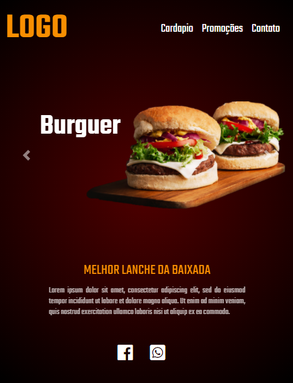

 
  
 

<h1 align="center">
     :hamburger: <a href="#" alt="site do ecoleta"> Hamburgueria </a>:hamburger:
</h1>

<h3 align="center">
    O melhor point para esquecer a sua fome :fries:
</h3>

 

## :shipit: Sobre
Site criado para atualizar o sistema de uma lanchonete, a tornado mais expansiva no alcance de seu publico e melhorando a agilidade no qual seus clientes fazem seus pedidos levando em consideração que o cardapio e todo tipo de informação necessaria se encontra no mesmo.

<h3 >
Link: https://hamburgueria-point.netlify.app
</h3>
 

## :checkered_flag: Conteudo

 ### Web

 
  

 ### Mobile
 

  

## 🛠 Ferramenta

A biblioteca Bootstrap foi utilizada para conclusão desse projeto

- [Bootstrap] (https://getbootstrap.com/)
 

## 📝 Licença

Este projeto esta sobe a licença [MIT](./LICENSE).

### Autor
---

 

 <b>Carlos Vinicius</b></a> <a href="">🚀</a>
 

Feito com ❤️ por Carlos Vinicius 👋🏽 Entre em contato!

 

